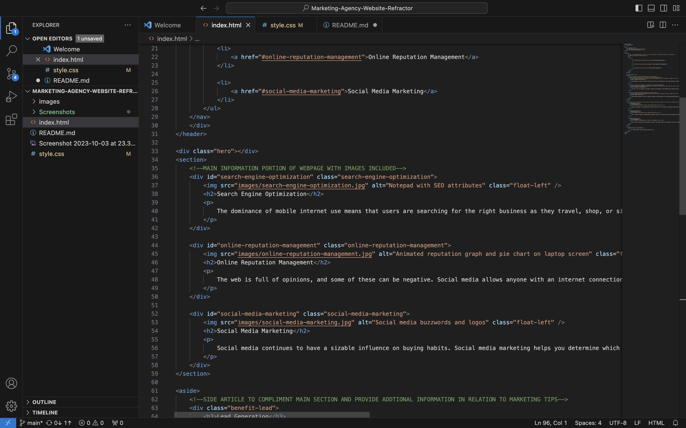

# Marketing Agency Website Refactor

This project aims to improve the accessibility and search engine optimization of a marketing agency website by implementing Semantic HTML and optimizing image alt attributes.

## Table of Contents
- [Introduction](#introduction)
- [Semantic HTML](#semantic-html)
- [Image Alt Attributes](#image-alt-attributes)
- [Deployment](#deployment)
- [Conclusion](#conclusion)

## Introduction

In this project, we are enhancing the structure and accessibility of a marketing agency website. By using Semantic HTML elements and optimizing image alt attributes, we aim to make the website more user-friendly, accessible, and search engine friendly.

## Semantic HTML

Semantic HTML tags provide meaningful structure to web content. Here are some examples of how we've incorporated Semantic HTML:

By using tags like footer, header, and nav we’ve organized the content in a way that’s easy for both users and search engines to understand.

## Image Alt Attributes

Optimizing image alt attributes is crucial for accessibility and SEO. All images now have descriptive alt attributes as seen in the screenshot.

These alt attributes provide context and improve accessibility for users who rely on screen readers or encounter image loading issues.

## Deployment

To deploy and run this project, follow these steps:

1. **Click this link for the deployed version**: https://rublo256.github.io/Marketing-Agency-Website-Refactor/

2. **Clone the Repository**: Clone this repository to your local machine using Git: https://github.com/RubLo256/Marketing-Agency-Website-Refactor.git

## Conclusion

By implementing Semantic HTML and optimizing image alt attributes, we’ve made significant improvements to the marketing agency website’s accessibility and search engine optimization. These enhancements not only benefit users with disabilities but also increase the website’s chances of ranking higher in search engine results.